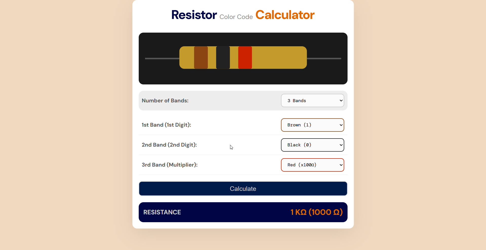

# **Resistor Color Code Calculator**

**Resistor Color Code Calculator** is a useful, interactive and modern web application (built with HTML, CSS and JavaScript) that calculates the resistance value of 3, 4, 5, and 6-band resistors.

-----
-----

## Interface Preview
A 3-band resistor example showing Brown (1), Black (0), Red (x100Ω) bands resulting in a resistance of 1 KΩ (1000 Ω)].

-----

## Features
- Supports 3, 4, 5, and 6-band resistors.
- Live SVG preview that updates based on user's choices.
- Input validation with error messages.
- Color-coded dropdown borders for visual feedback.
- Automatic unit conversion (Ω → KΩ → MΩ) based on resistance.

-----

## User Guide
1. Select the number of bands.
2. Choose the color for each band from the dropdown menus.
3. Click **Calculate** to display the resistance value.

-----

## Mathematical Logic
The resistance value is calculated based on the number of bands:

**3-Band Resistor:**

$$R = (digit_1 \times 10 + digit_2) \times multiplier$$

**4-Band Resistor:**

$$R = (digit_1 \times 10 + digit_2) \times multiplier \pm tolerance$$

**5-Band:**

$$R = (digit_1 \times 100 + digit_2 \times 10 + digit_3) \times multiplier \pm tolerance$$

**6-Band:**

$$R = (digit_1 \times 100 + digit_2 \times 10 + digit_3) \times multiplier \pm tolerance$$
$$\text{+ Temperature Coefficient (ppm/K)}$$

-----

## Glossary of Terms
* **Resistance:** The measure of the opposition to the flow of electric current within a circuit, measured in Ohms (Ω).
* **Band:** A colored ring painted on the body of a resistor, representing a specific numerical value, multiplier, or tolerance.
* **Significant Digit:** The primary numbers derived from the first two (or three) bands, which form the base value of the resistor.
* **Multiplier:** The factor by which the significant digits are multiplied to determine the total resistance in Ohms ($\Omega$).
* **Tolerance:** The acceptable percentage by which the actual resistance is allowed to deviate from its stated nominal value.
* **Temperature Coefficient:** The rate at which the resistance value changes in response to temperature variations, typically measured in ppm/K.
* **ppm/K:** Parts per million per Kelvin. A unit denoting how many millionths of an Ohm the resistance will change for each degree Kelvin (or Celsius) change in temperature.

-----

## Built With
- HTML
- CSS
- JavaScript

## Project Structure
* `index.html`: The main structure, UI layout, and SVG layout.
* `style.css`: Styling, transitions, and responsive design.
* `script.js`: Core logic for calculations, UI toggling, and validation.

## Acknowledgements
- Fonts by [Google Fonts](https://fonts.google.com) (*DM Sans* & *DM Mono*)

-----

## License
MIT License: Free to use, modify, and distribute with attribution.

-----
-----

## **Developer**
**Dimitrios Poulos**  
*Electrical \& Computer Engineering Student*
* **Release Date:** February 2026
